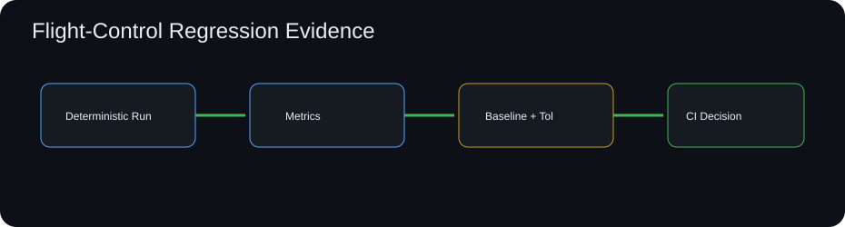

# Flight Control Regression Test Lab

[](https://github.com/skytruong90/Flight-Control-Regression-Test-Lab/actions/workflows/ci.yml)


A synthetic regression-testing laboratory for a generic flight-control surrogate. It runs a deterministic closed-loop response, compares key metrics against a versioned baseline, applies explicit tolerances, and produces a machine-readable regression report.



> Educational/public software project. The controller and plant are generic and are not flight-qualified or derived from a real aircraft.

## Why regression evidence matters

Numerical software can change behavior even when tests still compile and execute. A useful regression system therefore compares engineering outputs—not only code paths. This repository demonstrates a baseline/tolerance workflow for control-response metrics.

## Capabilities

- deterministic step-response surrogate
- overshoot, settling error, rise time, and control-effort metrics
- versioned baseline JSON
- absolute/relative tolerance checks per metric
- detailed changed/unchanged metric report
- explicit baseline-update helper command
- non-zero exit code for CI regression failures
- automated tests and GitHub Actions

## Run it

```bash
git clone https://github.com/skytruong90/Flight-Control-Regression-Test-Lab.git
cd Flight-Control-Regression-Test-Lab
python -m venv .venv
# Linux/macOS: source .venv/bin/activate
# Windows PowerShell: .venv\Scripts\Activate.ps1
python -m pip install -e ".[dev]"
flight-regression run --baseline baselines/nominal.json --output output/report.json
```

Run tests:

```bash
pytest
ruff check .
```

Generate a candidate baseline intentionally:

```bash
flight-regression capture --output output/candidate-baseline.json
```

The workflow keeps **capture** separate from **verification** so a code change cannot silently bless its own result.

## What I learned / demonstrated

- numerical regression tests should compare meaningful engineering metrics, not raw floating-point arrays alone
- tolerances must be visible, version controlled, and metric specific
- baseline creation and baseline verification should be separate actions
- deterministic model inputs are essential for diagnosing behavioral drift
- a compact JSON report makes regressions consumable by CI dashboards or review automation

## Limitations

The model is a first-order synthetic plant with a PI controller. The repository demonstrates regression methodology, not a real control-system design.
